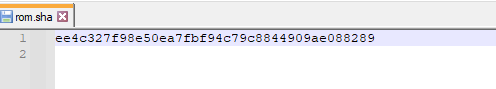
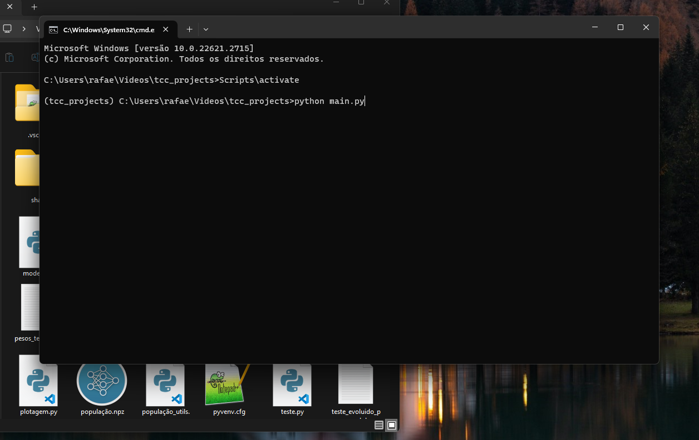
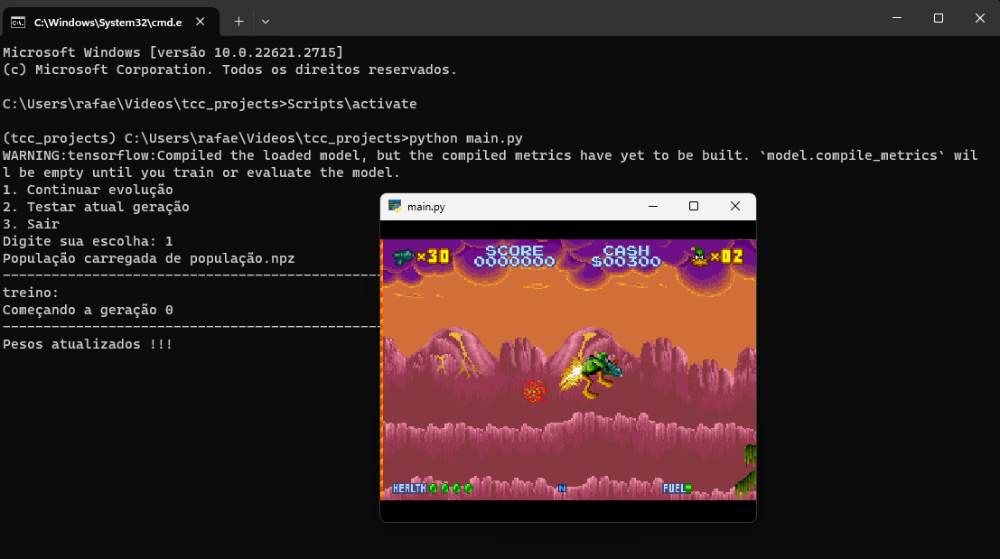

# Algoritmo genético de pesos

Este projeto implementa um Algoritmo de Pesos em uma arquitetura de rede neural fixa, utilizando um algoritmo genético. A estrutura da rede inclui uma parte convolucional baseada na arquitetura InceptionV3 da Google, seguida por camadas densas. Durante o treinamento no jogo Daffy Duck: The Marvin Missions, a aptidão de cada agente é avaliada com base em sua pontuação, vidas, barra de vida e ações realizadas. Os melhores agentes são selecionados para reprodução, utilizando cruzamento uniforme e mutação para gerar a próxima geração. O projeto visa criar uma solução adaptativa para treinamento de modelos de aprendizado de máquina.

# Configuração do ambiente

Para a execução deste projeto, foi essencial estabelecer um ambiente de desenvolvimento local no sistema operacional Windows 11. A implementação contou com a utilização do Python 3.8, além das bibliotecas Gym na versão 0.21.0 e Gym Retro na versão 0.8.0. Importante ressaltar que versões mais recentes dessas bibliotecas são incompatíveis com as versões anteriores.

Após a configuração do ambiente, tornou-se necessário adquirir uma ROM do jogo Daffy Duck: The Marvin Missions, escolhido para os testes. A ROM precisa coincidir com a SHA1 determinada pelo Gym Retro em suas instalações para o respectivo jogo.

Com o ambiente e o jogo devidamente configurados, o próximo passo consiste na compilação e execução do código Python. Basta abrir o prompt de comando na pasta onde todas as configurações foram realizadas, digitar "Scripts\activate" e pressionar "Enter". Em seguida, o código pode ser executado acessando o diretório onde o código está localizado e utilizando o comando "python nome_do_arquivo.py".

